# RaspberryPi Pico Dev Board

## Getting Started

The PCB has a few options for how it is configured. Both the development and debug 
host pico can be soldered directly to the board (using the castellated pads).

My personal preference is to solder the debug host pico directly to the board with
the development pico mounted to the board via headers.

### Preparing the hardware

**Required Tools**

- Soldering Iron

**Required Components**

General components required for all mounting approaches

|                                                        | Part                                | Count |
|--------------------------------------------------------|-------------------------------------|-------|
| 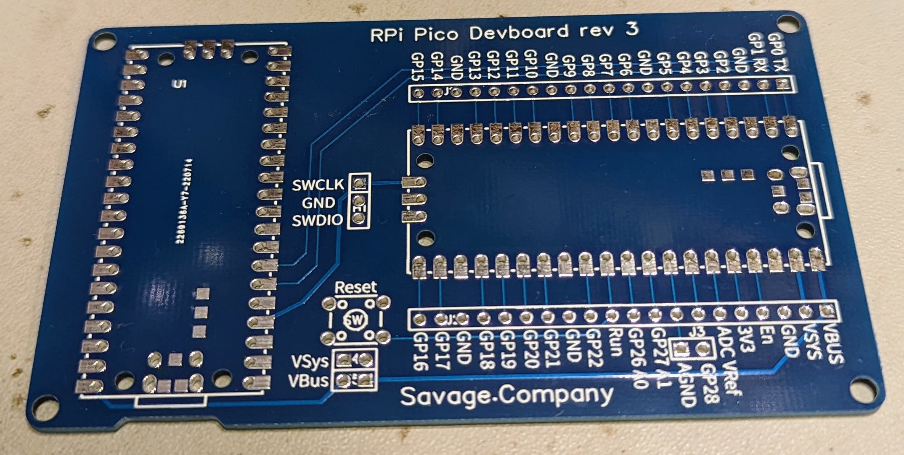              | RPi Pico Devboard                   | 1     |
| 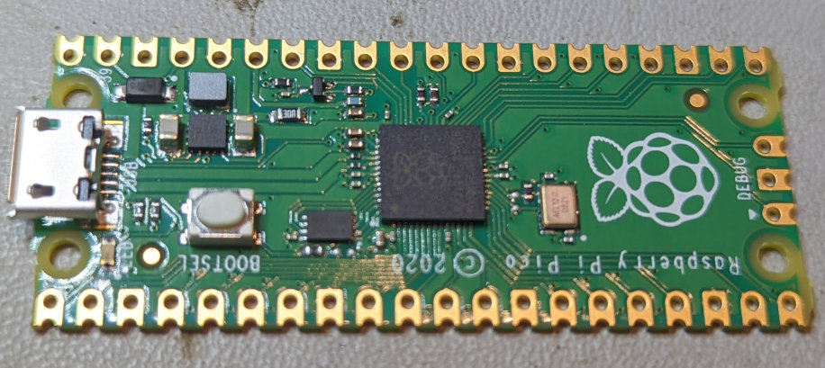                        | Pico (debug host)                   | 1     |
| 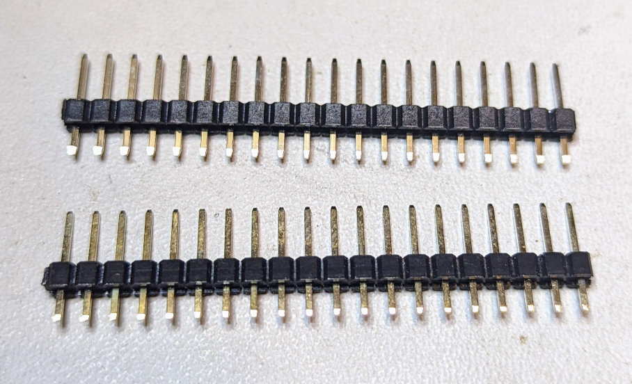 | 20x1 Male Headers                   | 2     |
| 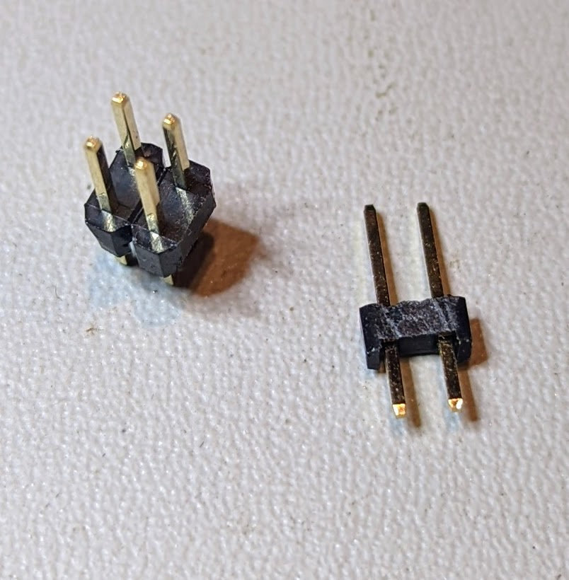   | 2x2 Male & 2x1 Male Headers         | 1     |
| 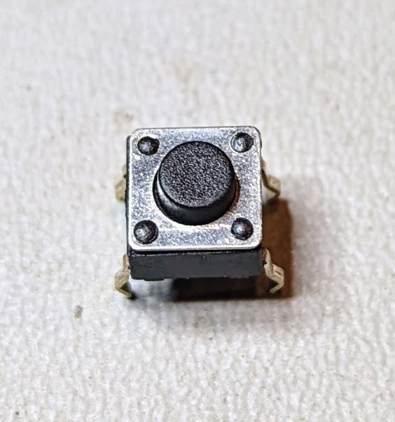                    | Micro pushbutton (reset)            | 1     |
| 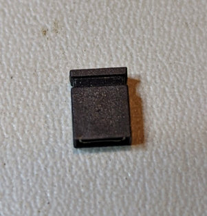                    | Jumper (to enable VBus/Vsys & AGnd) | 1-2   |

With the development board mounted using headers

|                                                                | Part                                   | Count |
|----------------------------------------------------------------|----------------------------------------|-------|
| 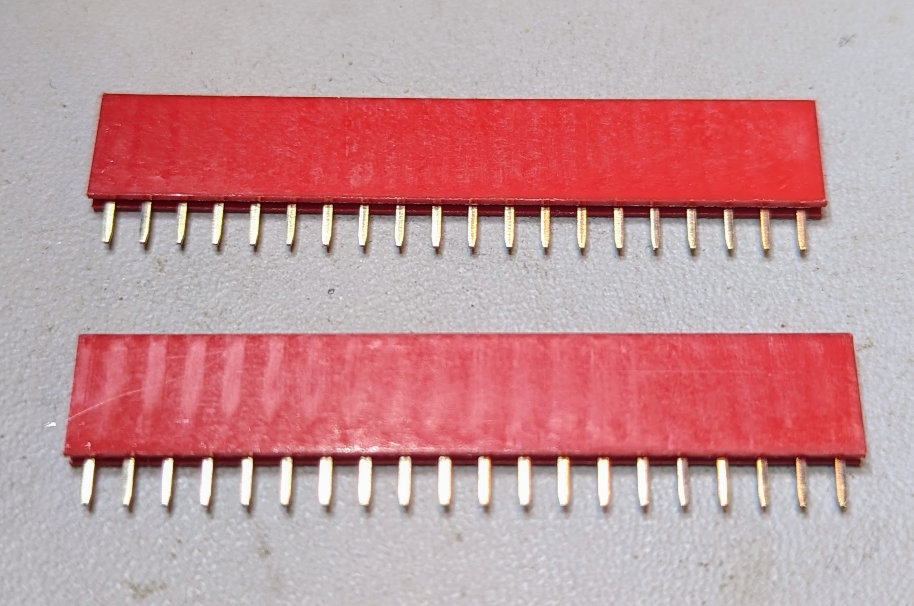       | 20x1 Female Headers                    | 2     |
| 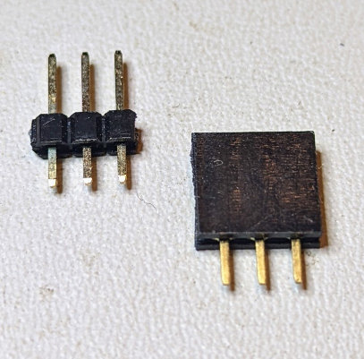 | 3x1 Male & Female Headers (debug port) | 1     |

If you wish to mount the debug host using headers another pair of 20x1 Female headers is required.

**Optional Components**

These components are optional, but recommended to raise the board off the table

|                                                 | Part         | Count |
|-------------------------------------------------|--------------|-------|
| 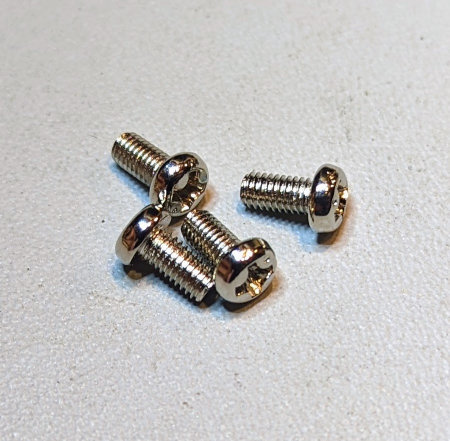       | M3 Screws    | 4     |
| 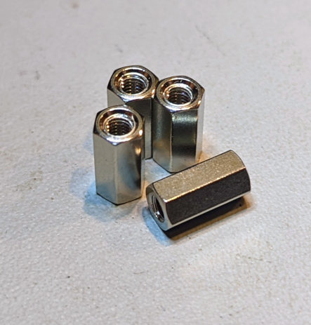 | M3 Standoffs | 4     |

**Building the Board**

1. Solder the Pico debug host to the board.
   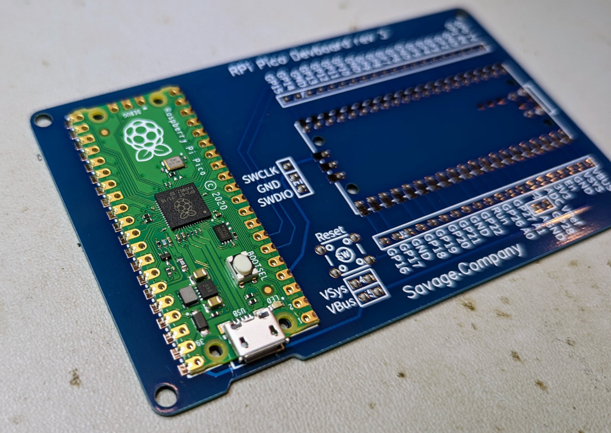

   - To solder the Pico first line up the pico and solder one corner.
   - Ensure the pico is still aligned and solder the opposite corner.
   - Not all pads need to be soldered however the pads with a red should be soldered
     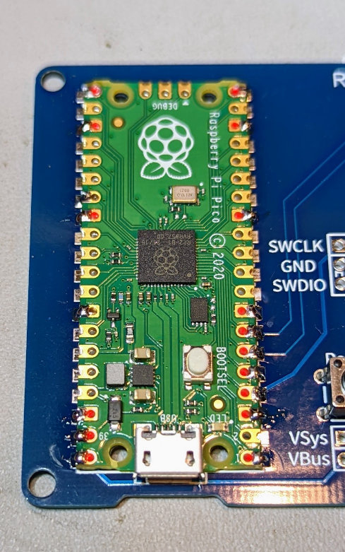
   
   > **Tip!** The pads with squared off edges are Ground pads. As the ground plane on the back 
   > of the dev board is large it acts as heat-sink.           
   > Hold your soldering iron next to the pad for a few seconds to add heat into the dev board 
   > before adding solder to make this easier.

2. Solder the reset button to the board.
   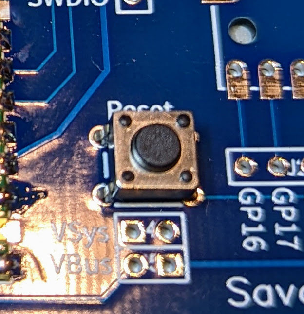
3. Solder the male headers to the board.
   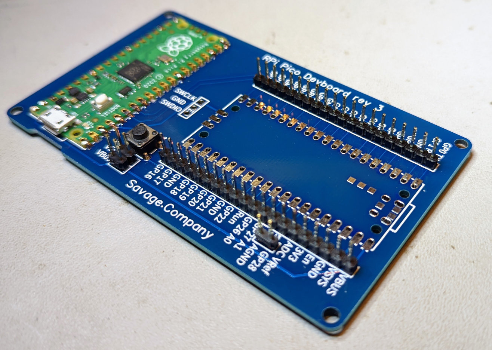
4. Solder the female headers to the board. To ensure they are aligned mount use a pico to line 
   the headers up before soldering.
   - Add headers to a pico
     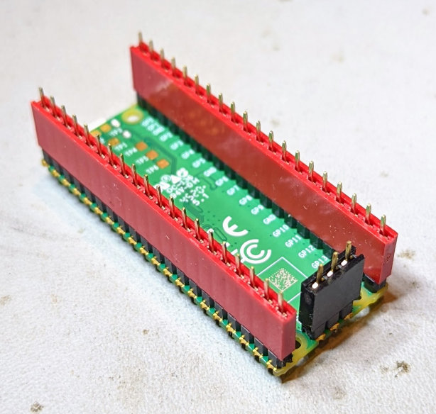
   - Solder it in place
     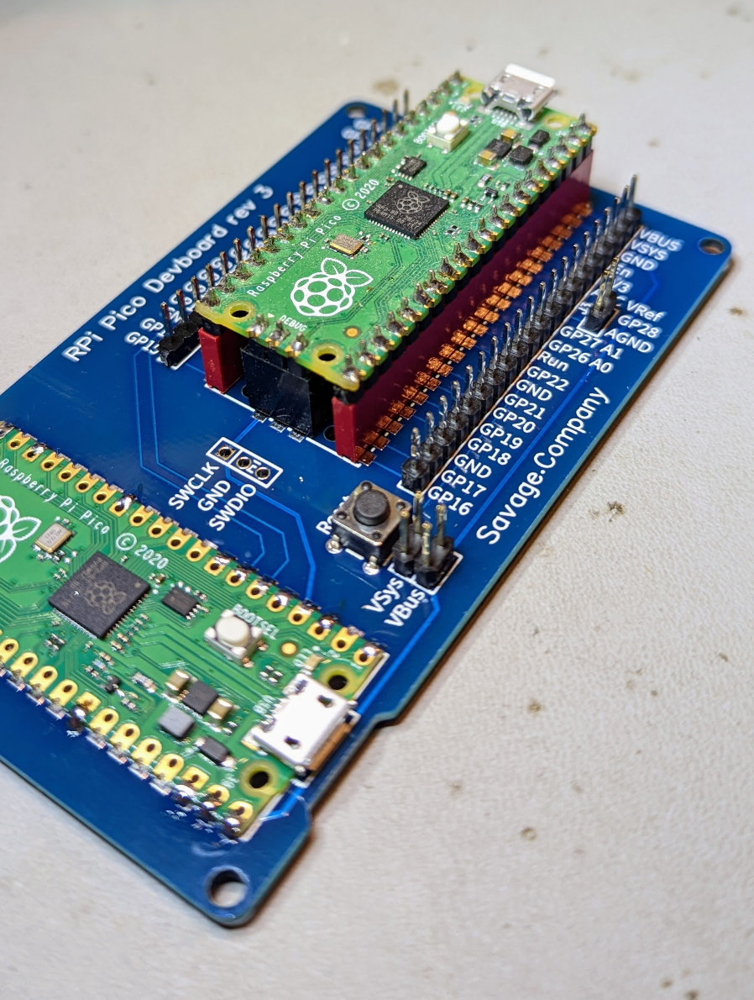
5. Add the jumper to enable VBus or VSys to power the dev pico from the debug pico. VBus is 
   recommended to take power straight from the USB bus
   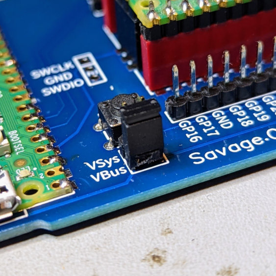
