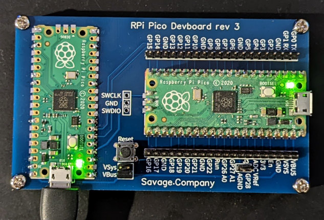
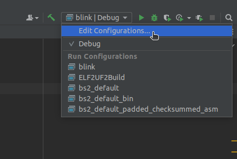
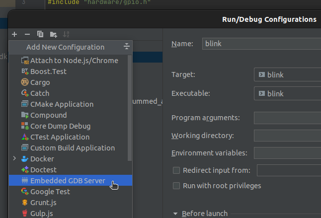
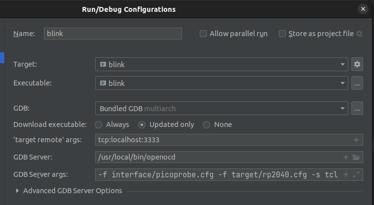
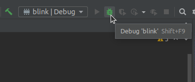
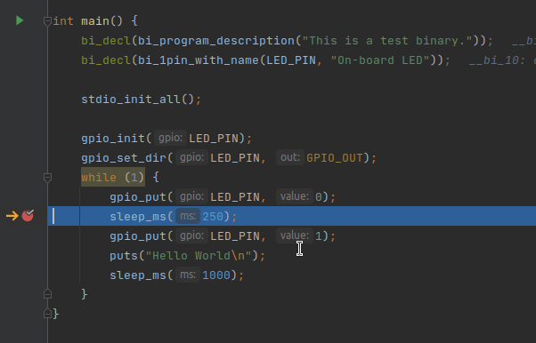

# RaspberryPi Pico Dev Board

The RPi Pico is a great low cost powerful ARM based development platform. This dev
board enhances the platform with a carrier board with:

   - A debug host (using picoprobe) for on chip debugging of code
   - A serial interface (again via picoprobe) 
   - The missing reset button!
   - Breakout of all pins from the pico
   - Development board powered by either the VSys or VBus sources

Compatible with all Pico variants

   - Pico
   - Pico-H
   - Pico-W

Schematic and PCB Layout available at [OSHWLab](https://oshwlab.com/tim.savage/pipico-devboard). 



## Getting Started

The PCB has a few options for how it is configured. Both the development and debug 
host pico can be soldered directly to the board (using the castellated pads).

My personal preference is to solder the debug host pico directly to the board with
the development pico mounted to the board via headers.

### Preparing the hardware

#### Required Tools

Tools you are going to need

- Soldering Iron

#### Required Components

General components required for all mounting approaches

|                                                                                   | Part                                  | Count |
|-----------------------------------------------------------------------------------|---------------------------------------|-------|
|               | RPi Pico Devboard                     | 1     |
|                         | Pico debug host (cannot use a pico-h) | 1     |
|  | 20x1 Male Headers                     | 2     |
|    | 2x2 Male & 2x1 Male Headers           | 1     |
|                     | Micro pushbutton (reset)              | 1     |
|                     | Jumper (to enable VBus/Vsys & AGnd)   | 1-2   |

With the development board mounted using headers

|                                                                                           | Part                                   | Count |
|-------------------------------------------------------------------------------------------|----------------------------------------|-------|
|        | 20x1 Female Headers                    | 2     |
|  | 3x1 Male & Female Headers (debug port) | 1     |

If you wish to mount the debug host using headers another pair of 20x1 Female headers is required.

#### Optional Components

These components are optional, but recommended to raise the board off the table

|                                                                            | Part         | Count |
|----------------------------------------------------------------------------|--------------|-------|
|        | M3 Screws    | 4     |
|  | M3 Standoffs | 4     |

#### Building the Board

1. Solder the Pico debug host to the board. First line up the pico and solder one corner, 
   ensure the pico is still aligned and solder the opposing corner.

   All pads marked with a red dot should be soldered (the rest are optional)

   
   
   > **Tip!** The pads with squared off edges are Ground pads. As the ground plane on the back 
   > of the dev board is large it acts as heat-sink.           
   > Hold your soldering iron next to the pad for a few seconds to add heat into the dev board 
   > before adding solder to make this easier.

2. Solder the reset button to the board.

   
   
3. Solder the male headers to the board.

   

4. Solder the female headers to the board. To ensure they are aligned mount use a pico to line 
   the headers up before soldering.
   - Add headers to a pico
   
     
     
   - Solder it in place
     
     
   
5. Add the jumper to enable VBus or VSys to power the dev pico from the debug pico. VBus is 
   recommended to take power straight from the USB bus.

   


### Preparing the software

You will need:

- [Pico SDK](https://www.raspberrypi.com/documentation/microcontrollers/c_sdk.html#sdk-setup) installed

- A working IDE for debugging
 
   Follow the instructions for setting up PicoProbe and installing the firmware in 
   *Chapter 10. Using other Integrated Development Environments* of the 
   [Getting Started with Pico](https://datasheets.raspberrypi.com/pico/getting-started-with-pico.pdf)
   user guide.

- Pico Probe and OpenOCD

   Follow the instructions for setting up PicoProbe and installing the firmware in 
   *Appendix A: Using Picoprobe* of the 
   [Getting Started with Pico](https://datasheets.raspberrypi.com/pico/getting-started-with-pico.pdf)
   user guide.

If you are happy to use Visual Studio code you should now have a working development environment
with debug support. If you prefer CLion (I do) then follow to the next section.


#### Configuration of Open OCD in CLion

> This section assumes you have a working build in CLion after following the
> [Getting Started with Pico](https://datasheets.raspberrypi.com/pico/getting-started-with-pico.pdf)
> user guide.

The user guide skips the final step of hooking into OpenOCD via GDB in CLion allowing you 
to hit run and debug from directly in the IDE and to set breakpoints and step through your code.

1. Open the edit configs window

   

2. Add an embedded GDB Server

   

3. Select your target and executable and use the following settings:
   
   | Setting              | Value                                                    |
   |----------------------|----------------------------------------------------------|
   | 'target remote' args | `tcp:localhost:3333`                                     |
   | GDB Server           | `/usr/local/bin/openocd`<sup>1</sup>                     |
   | GDB Server args      | `-f interface/picoprobe.cfg -f target/rp2040.cfg -s tcl` |

   <sup>1</sup> Location where OpenOCD binary was installed
    
   

4. Hit Debug and set a breakpoint!

   

   

## Gotchas

### Open OCD unable to access Pico Probe on Linux

The port used to access pico probe is r/w to root only. A UDev rule is required to
change the ownership of the port.

Place the following into the file: `/etc/udev/rules.d/60-openocd.rules`
```
# Raspberry Pi Picoprobe
ATTRS{idVendor}=="2e8a", ATTRS{idProduct}=="0004", MODE="660", GROUP="plugdev", TAG+="uaccess"
```

Reconnect the dev board to update permissions. 

Next add your user to the `plugdev` group with:

> Assuming your distribution uses sudo:
> 
> `sudo usermod -aG plugdev $USER`

You will need to re-login for this change to take effect.
